# Governance Authority Agent

<!-- TOC -->
* [Governance Authority Agent](#governance-authority-agent)
  * [Description](#description)
  * [Pre-Requisites](#pre-requisites)
    * [Tools](#tools)
  * [Installation](#installation)
    * [Prerequisites](#prerequisites)
      * [Create the Namespace](#create-the-namespace)
      * [Verify the Namespace](#verify-the-namespace)
    * [Deployment using ArgoCD](#deployment-using-argocd)
    * [Manual deployment](#manual-deployment)
      * [Files preparation](#files-preparation)
      * [Deployment](#deployment)
  * [Additional steps](#additional-steps)
    * [Monitoring](#monitoring)
* [Troubleshooting](#troubleshooting)
<!-- TOC -->

## Description
This project contains the configuration files required for deploying an application using Helm and ArgoCD. 
- the deployment will be done by master helm chart allowing to deploy a **Governance Authority** agent using a single command.
- templates of values.yaml files used inside *Integration* environment under `app-values` folder

## Pre-Requisites

### Tools

| Pre-Requisites         |     Version     | Description                                                                                                                                     |
| ---------------------- |     :-----:     | ----------------------------------------------------------------------------------------------------------------------------------------------- |
| DNS sub-domain name    |       N/A       | This domain will be used to address all services of the agent. <br/> example: `*.authority03.testint.simpl-europe.eu`                            |  
| external-dns    | bitnami/external-dns:0.16.1 | Currently version docker.io/bitnami/external-dns:0.16.1-debian-12-r should be used as externaldns. Unfortunately, using a newer version caused DNS to work incorrectly. |  
| Kubernetes Cluster     | 1.29.x or newer | Other version *might* work but tests were performed using 1.29.x version                                                                        |
| nginx-ingress          | 1.10.x or newer | Used as ingress controller. <br/> Other version *might* work but tests were performed using 1.10.x version. <br/> Image used: `registry.k8s.io/ingress-nginx/controller:v1.10.0`  |
| cert-manager           | 1.15.x or newer | Used for automatic cert management. <br/> Other version *might* work but tests were performed using 1.15.x version. <br/> Image used: `quay.io/jetstack/cert-manager-controller:v1.15.3` |
| nfs-provisioner        | 4.0.x or newer  | Backend for *Read/Write many* volumes. <br/> Other version *might* work but tests were performed using 4.0.x version. <br/> Image used: `registry.k8s.io/sig-storage/nfs-provisioner:v4.0.8` |
| argocd                 | 2.11.x or newer | Used as GitOps tool . App of apps concept. <br/> Other version *might* work but tests were performed using 2.11.x version. <br/> Image used: `quay.io/argoproj/argocd:v2.11.3` |

**Tools like nginx-ingress,cert-manager,external-dns,kubernetes are provided by DevSecOps team on each OVH cluster and are maintaned by them. You should not attempt to install any of those tools as they are already provided. All kubernetes LoadBalancer services and ingresses are exposed automatically.**

If you want to see helm configuration of each tool we are providing please see [fleet repository](https://code.europa.eu/simpl/simpl-open/Operations/fleet) with helm values for each tool.

From fleet file like nfs-server you can create helm values file and apply it via `kubectl` command.

For example in fleet:

```yaml
defaultNamespace: nfs-server
targetCustomizations:
- name: nfs-server
  helm:
    releaseName: nfs-server
    chart: "nfs-subdir-external-provisioner"
    repo: "https://kubernetes-sigs.github.io/nfs-subdir-external-provisioner/"
    version: ""
    force: false
    timeoutSeconds: 0
    values:
      persistence:
        enabled: true
        storageClass: csi-cinder-high-speed
        size: 10Gi
  clusterSelector:
    matchLabels:
      nfs-server: true
```

Turn it into values.yaml file with provided custom values:

```yaml
persistence:
  enabled: true
  storageClass: csi-cinder-high-speed
  size: 10Gi
```

Than apply helm chart with created values file:

```
helm repo add nfs-subdir-external-provisioner https://kubernetes-sigs.github.io/nfs-subdir-external-provisioner/
helm install nfs-subdir-external-provisioner nfs-subdir-external-provisioner/nfs-subdir-external-provisioner -n <namespace> -f values.yaml
```

Here are references to documentations for each tool provided:
- [ArgoCD](https://confluence.simplprogramme.eu/display/SIMPL/02+-+ArgoCD)
- [NFS provisioner](https://confluence.simplprogramme.eu/display/SIMPL/07+-+NFS+Server+for+provisioning+RWX+PVs)
- [External-DNS](https://confluence.simplprogramme.eu/display/SIMPL/16+-+external-dns)
- [Cert-Manager and Nginx-Ingress](https://confluence.simplprogramme.eu/display/SIMPL/27+-+Certificates)

## DNS entries 

| Entry Name | Entries |
| ------------- | --------------------------------------------------------------------------------------------------- |
| adapter-ingress | adapter.(namespace).int.simpl-europe.eu
| simpl-fe-ingress | authority.fe.(namespace).int.simpl-europe.eu/sap<br>authority.fe.(namespace).int.simpl-europe.eu/onboarding<br>authority.fe.(namespace).int.simpl-europe.eu/users-roles<br>authority.fe.(namespace).int.simpl-europe.eu/participant-utility 
| simpl-ingress | a&#8203;uthority.be.(namespace).int.simpl-europe.eu
| xsfc-service | xsfc-server-service.(namespace).int.simpl-europe.eu

## Installation

The deployment is based on master helm chart which, when applied on Kubernetes cluster, should deploy the Authority to it using ArgoCD. 

### Prerequisites

#### Vault related tasks

All the secrets are now generated and stored automatically on deployment of Common namespace.

### Deployment using ArgoCD

You can easily deploy the agent using ArgoCD. All the values mentioned in the sections below you can input in ArgoCD deployment. The repoURL gets the package directly from code.europa.eu.
targetRevision is the package version. 

When you create it, you set up the values below (example values)

```
apiVersion: argoproj.io/v1alpha1
kind: Application
metadata:
  name: 'authority03-deployer'             # name of the deploying app in argocd
spec:
  project: default
  source:
    repoURL: 'https://code.europa.eu/api/v4/projects/902/packages/helm/stable'
    path: '""'
    targetRevision: 2.1.0                   # version of package
    helm:
      values: |
        values:
          branch: v2.1.0                   # branch of repo with values - for released version it should be the release branch
        project: default                    # Project to which the namespace is attached
        namespaceTag: 
          authority: authority03            # identifier of deployment and part of fqdn for this agent
          common: common03                  # identifier of deployment and part of fqdn for common components
        domainSuffix: int.simpl-europe.eu   # last part of fqdn
        argocd:
          appname: authority03              # name of generated argocd app 
          namespace: argocd                 # namespace of your argocd
        cluster:
          address: https://kubernetes.default.svc
          namespace: authority03             # where the app will be deployed
          commonToolsNamespace: common      # namespace where main monitoring stack is deployed
          issuer: dev-int-dns01             # certificate issuer name
        hashicorp:
          role: dev-int-role                # role created in vault for access
          secretEngine: dev-int             # container for secrets in your vault
        monitoring:
          enabled: true                     # you can set it to false if you don't have common monitoring stack
    chart: authority
  destination:
    server: 'https://kubernetes.default.svc'
    namespace: authority03                  # where the package will be deployed
```

### Manual deployment

#### Files preparation

Another way for deployment, is to unpack the released package to a folder on a host where you have kubectl and helm available and configured. 

There is basically one file that you need to modify - values.yaml. 
There are a couple of variables you need to replace - described below. The rest you don't need to change. 

```
values:
  repo_URL: https://code.europa.eu/simpl/simpl-open/development/agents/governance-authority.git   # repo URL
  branch: v2.1.0                    # branch of repo with values - for released version it should be the release branch
project: default                                  # Project to which the namespace is attached

namespaceTag: 
  authority: authority03            # identifier of deployment and part of fqdn for this agent
  common: common03                  # identifier of deployment and part of fqdn for common components
domainSuffix: int.simpl-europe.eu                 # last part of fqdn

argocd:
  appname: authority03              # name of generated argocd app 
  namespace: argocd                 # namespace of your argocd
cluster:
  address: https://kubernetes.default.svc
  namespace: authority03                          # where the package will be deployed
  commonToolsNamespace: common                    # namespace where main monitoring stack is deployed
  issuer: dev-int-dns01                           # certificate issuer name

hashicorp:
  role: dev-int-role                              # role created in vault for access
  secretEngine: dev-int                           # container for secrets in your vault

monitoring:
  enabled: true                     # you can set it to false if you don't have common monitoring stack
```

#### Deployment

After you have prepared the values file, you can start the deployment. 
Use the command prompt. Proceed to the folder where you have the Chart.yaml file and execute the following command. The dot at the end is crucial - it points to current folder to look for the chart. 

Now you can deploy the agent:

`helm install authority . `


After starting the deployment synchronization process, the expected namespace will be created.


Initially, the status observed e.g. in ArgoCD will indicate the creation of new pods:

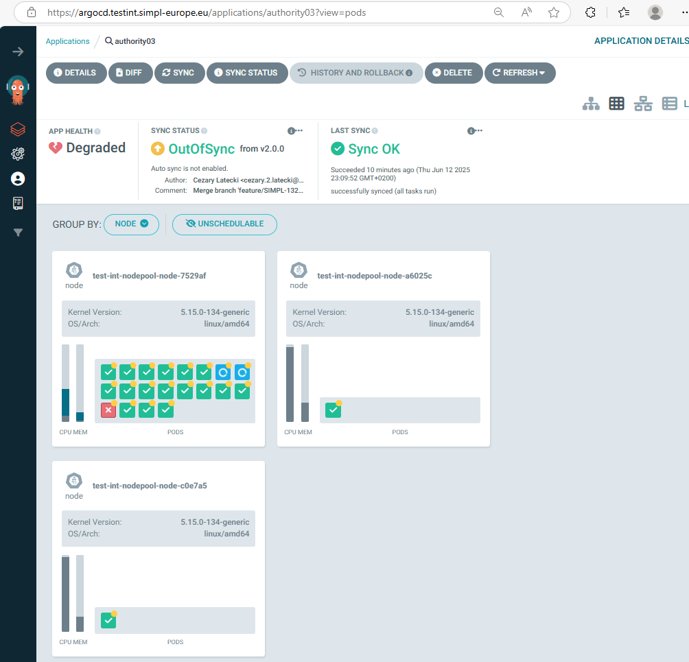<BR>

Be patient!... Depending on the configuration, this step can take up to 30 minutes!

At the end, all pods should be created correctly:

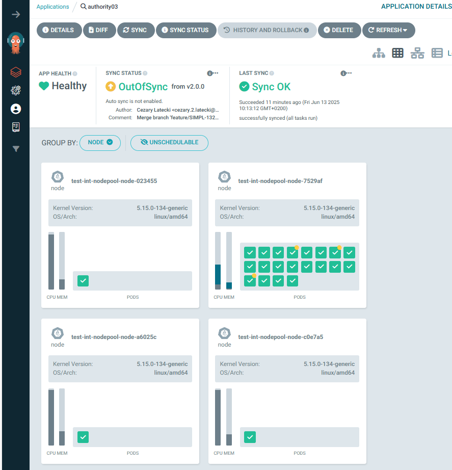<BR>


## Additional steps


### Authority Initialization

In the current version, after the deployment process is complete, a manual initialization process is required. 

kubectl will be necessary for this step, in order to port-forward required services.

In order to initialise the authority and obtain a valid certificate for mTLS communication with other participants, the following requests must be performed:

```bash
kubectl port-forward svc/authentication-provider 8080:8080 
kubectl port-forward svc/identity-provider 8090:8080

export AUTHORITY_AUTH_PROVIDER=localhost:8080
export AUTHORITY_IDENTITY_PROVIDER=localhost:8090

# Generating keypair...
curl -X POST "$AUTHORITY_AUTH_PROVIDER/v1/keypairs/generate"

# Generating CSR...
curl -X POST "$AUTHORITY_AUTH_PROVIDER/v1/csr/generate" \
--header 'Content-Type: application/json' \
--data-raw '{
  "commonName": "<tier2 hostname>",
  "country": "<country>",
  "organization": "<organization name>",
  "organizationalUnit": "<organizational unit name>"
}' > csr.pem

# Creating Authority participant
PARTICIPANT_ID=$(curl -X POST "$AUTHORITY_IDENTITY_PROVIDER/v1/participants" \
--header 'Content-Type: application/json' \
--data-raw '{
  "organization": "<organization name>",
  "participantType": "GOVERNANCE_AUTHORITY"
}' | sed -E 's/^"(.*)"$/\1/')

# Uploading CSR ..
curl -X POST "$AUTHORITY_IDENTITY_PROVIDER/v1/participants/$PARTICIPANT_ID/csr" \
-F "csr=@/path/to/csr.pem"

# Downloading credentials ...
curl "$AUTHORITY_IDENTITY_PROVIDER/v1/credentials/$PARTICIPANT_ID/download" \
-o cert.pem

# Uploading credentials ...
curl -X POST "$AUTHORITY_AUTH_PROVIDER/v1/credentials" \
-F "credential=@/path/to/cert.pem"
```

Above steps are taken from IAA documentation
https://code.europa.eu/simpl/simpl-open/development/iaa/documentation/-/tree/main/versioned_docs/2.2.x#governance-authority-init-via-apis


### Monitoring

Filebeat components for monitoring are included in this release.   
Their deployment can be disabled by switching the value monitoring.enabled to false.

# Troubleshooting
If you encounter issues during deployment, check the following:

- Ensure that ArgoCD is properly set up and running.
- Verify that the namespace exists in your Kubernetes cluster.
- Check the ArgoCD application logs and Helm error messages for specific issues.


# Typical error:

However, sometimes, probably due to cluster performance issues, an error related to identity-provider and Tier2-gateway appears:<BR>

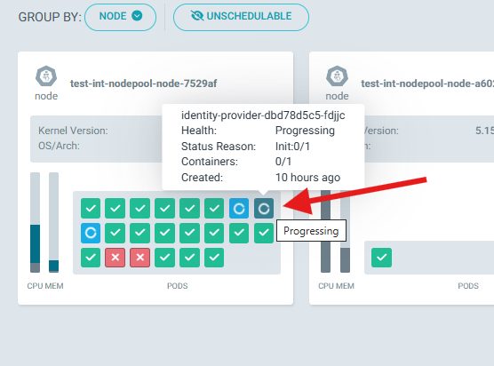<BR>

<BR>


The cause of the error should be checked. We can do this in Rancher by checking the ivents occurring on this pod:<BR>

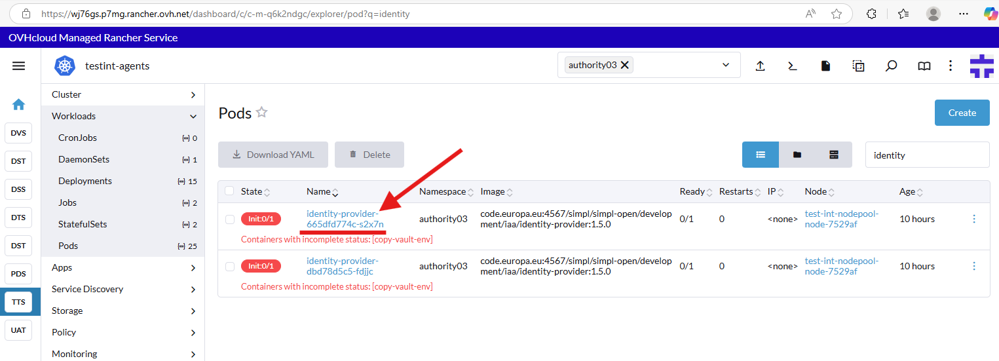<BR>

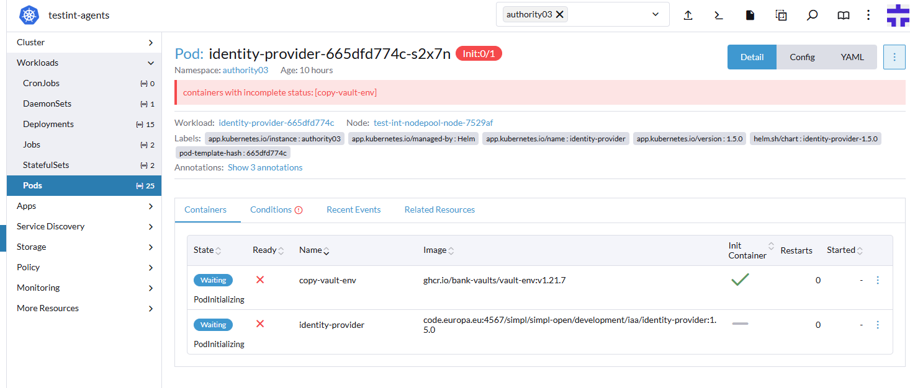<BR>

Unfortunately, a typical, frequently occurring error is the failure to automatically create an appropriate secret:<BR>

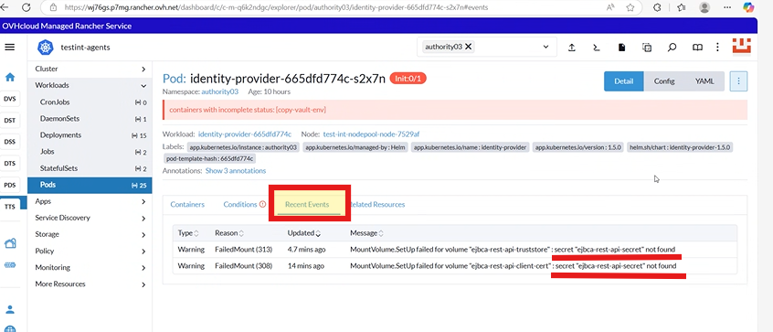<BR>

Unfortunately, to fix this error we need to delete two instances of the postgres databases.

In rancher please find the address to the postgres database:<BR>

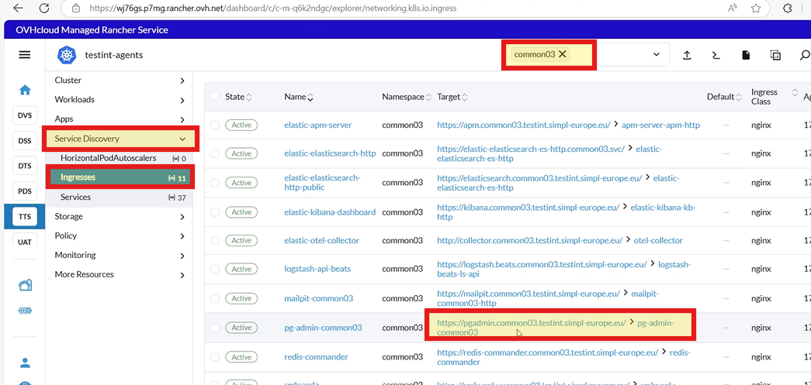<BR>

Access to the database is described in the document: https://code.europa.eu/simpl/simpl-open/development/agents/common_components/-/blob/main/documents/POSTGRESQL_ADMINISTRATION.md?ref_type=heads<BR>
However to log in we use the account admin@testint.simpl-europe.eu with password from the vault from the commonXX-pgadmin-credentials key for the "password" entry:<BR>
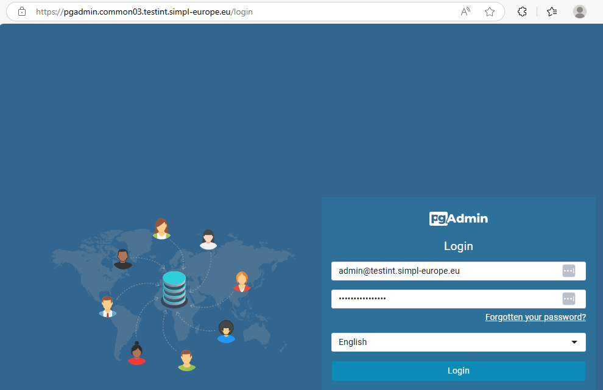<BR>

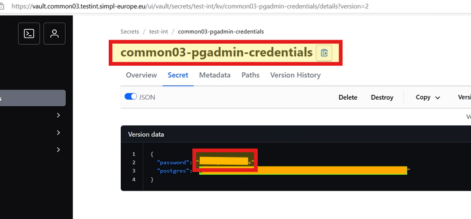<BR>

After accessing the website above, if you extend the Servers list, you will see the following request for password.
Password is in the same vault secret, in key named "postgres".<BR>

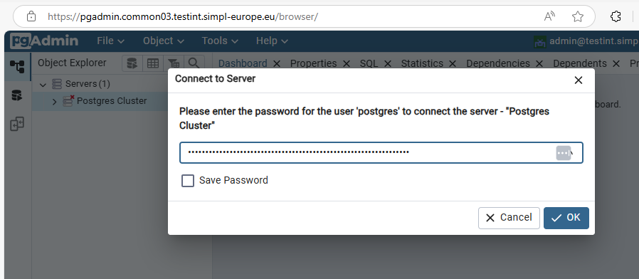<BR>

Now please remove two databases: authority03_ejbca and authority03_identityprovider:<BR>
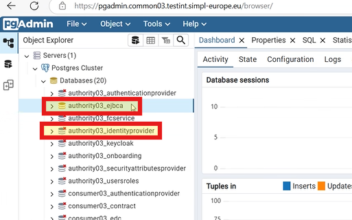<BR>
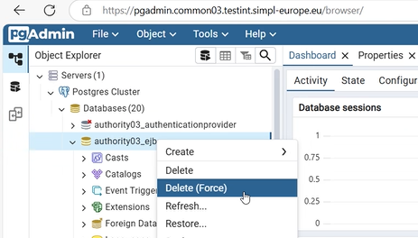<BR>

In the Common namespace restart pg-operator-commonXX (deploy) and check if the previously deleted databases have been created:<BR>
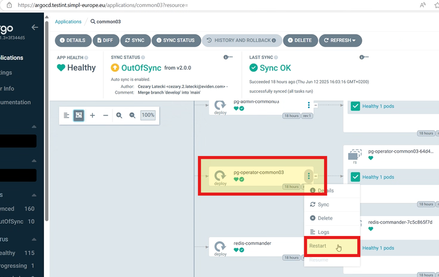<BR>

Next in namespace Authority delete identity_provider (deploy):<BR>
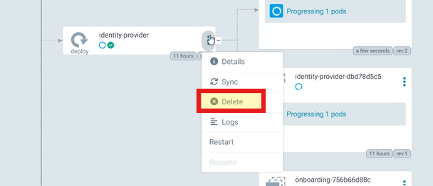<BR>

and ejbca-community-helm (deploy):<BR>
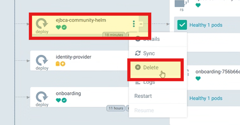<BR>

After full synchronization of the entire namespace Authority, the previously missing secret will already exist:<BR>
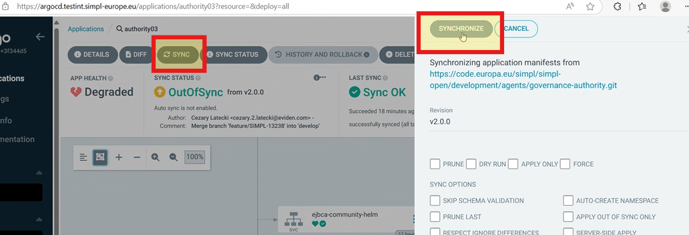<BR>
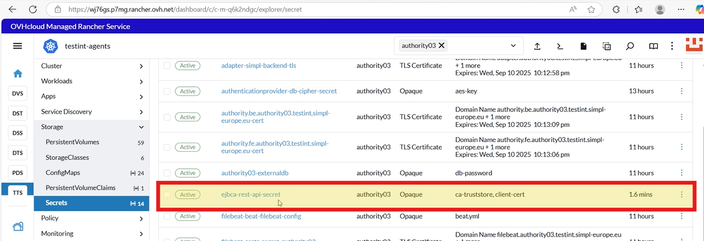<BR>

All that's left is to restart tier2-gateway (deploy) and all pods should work properly:<BR>
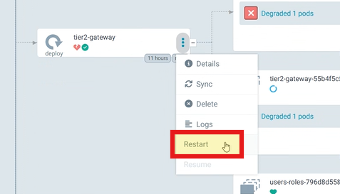<BR>


